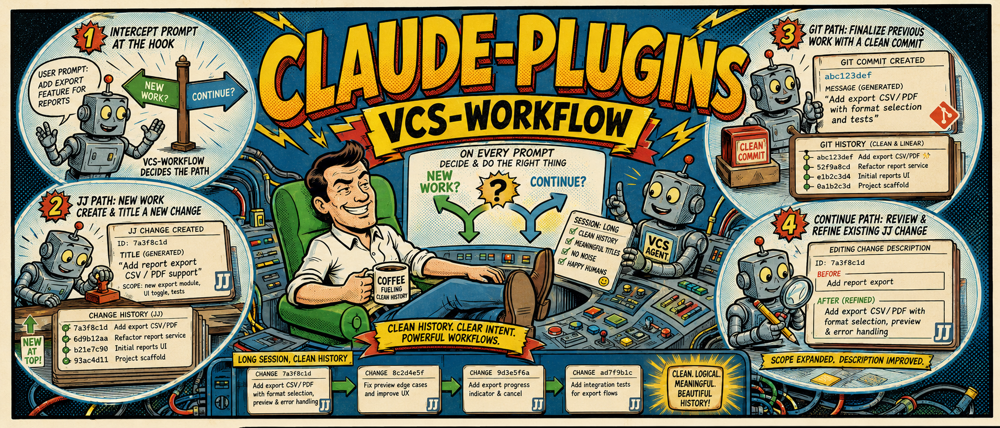

# claude-plugins

Personal marketplace of [Claude Code](https://claude.ai/code) plugins for AI-agent coding workflows. Also installable into ~20 other AI clients (Cursor, Codex, Gemini, Copilot, Windsurf, Cline, …) via [allagents](https://allagents.dev).



## Plugins

| Plugin | Purpose |
|---|---|
| [`vcs-workflow`](./vcs-workflow/) | Per-prompt reminder enforcing the describe-early / continuation / scope-shift / new-work decision tree, plus push-to-active-branch hygiene. Detects and adapts to jj-colocated, pure-jj, and pure-git repos. |

## Install (for users)

### Claude Code

```text
/plugin marketplace add zelanton/claude-plugins
/plugin install vcs-workflow@zelanton-claude-plugins
```

Plugins activate immediately. Updates land via `/plugin update`.

### Other clients via [allagents](https://allagents.dev)

```bash
npx allagents plugin marketplace add zelanton/claude-plugins --name zelanton
npx allagents plugin install vcs-workflow@zelanton
```

allagents reads the same `.claude-plugin/marketplace.json` and syncs plugin artifacts (hooks, skills, commands, MCP configs) to ~23 AI clients. On clients without hook support it falls back to the portable `SKILL.md` shipped under each plugin's `skills/` directory.

## Layout

```
.claude-plugin/marketplace.json   Marketplace manifest (lists all plugins)
<plugin-name>/                    One directory per plugin
  ├── .claude-plugin/plugin.json  Plugin manifest (hooks, skills, commands…)
  ├── hooks/                      Hook scripts (Claude/Copilot/Factory)
  ├── skills/<skill>/SKILL.md     Portable skill — loads on all 23 clients
  └── README.md                   Plugin-specific docs
```

## Versioning

Plugins follow rolling-`main` by default; `/plugin update` picks up new commits. Breaking changes get a git tag (`vX.Y.Z`) so users can pin if they need stability.

## License

MIT
